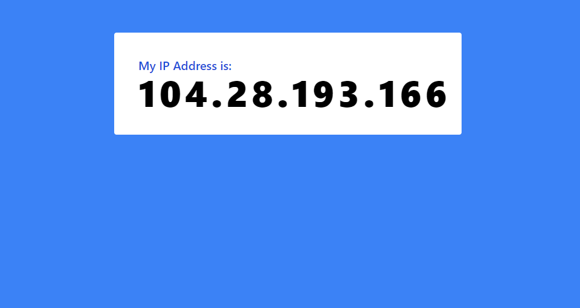

# Get My IP Web App

Get the IP of the visitor.

#### Screenshots



## 🎉 Check it yourself!

| 🚧 Build Status  | [](https://github.com/anburocky3/Get-My-IP-Web-App/actions/workflows/deploy.yml) |
| ---------------- | :-------------------------------------------------------------------------------------------------------------------------------------------------------------------------------------------- |
| ✅ Live Website: | [https://anburocky3.github.io/Get-My-IP-Web-App/](https://anburocky3.github.io/Get-My-IP-Web-App/)                                                                                            |

---

### Development

Just run and visit http://localhost:5173

```bash
npm run dev
```

### Build

To build the App, run

```bash
npm run build
```

And you will see the generated file in `dist` that ready to be served.

### Preview

To preview the build files, run

```bash
npm run preview
```

#### LICENSE: [MIT](./LICENSE)

#### Authors:

- [Anbuselvan Rocky](https://fb.me/anburocky3)
